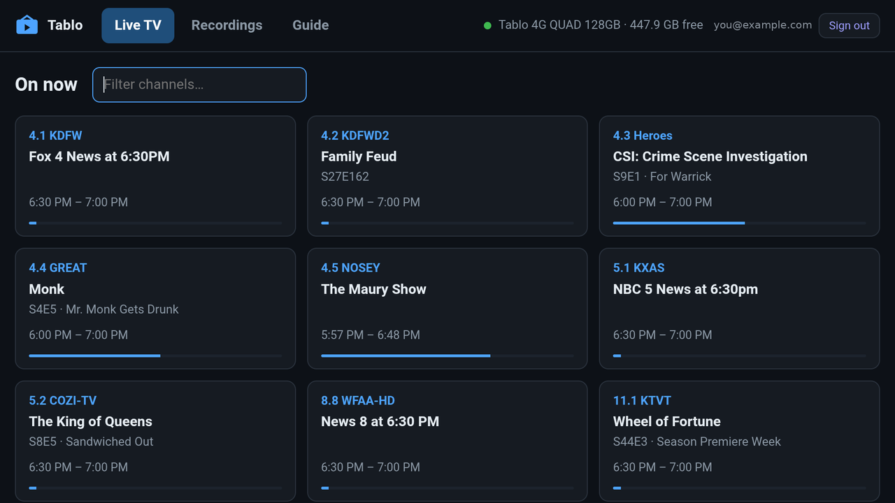
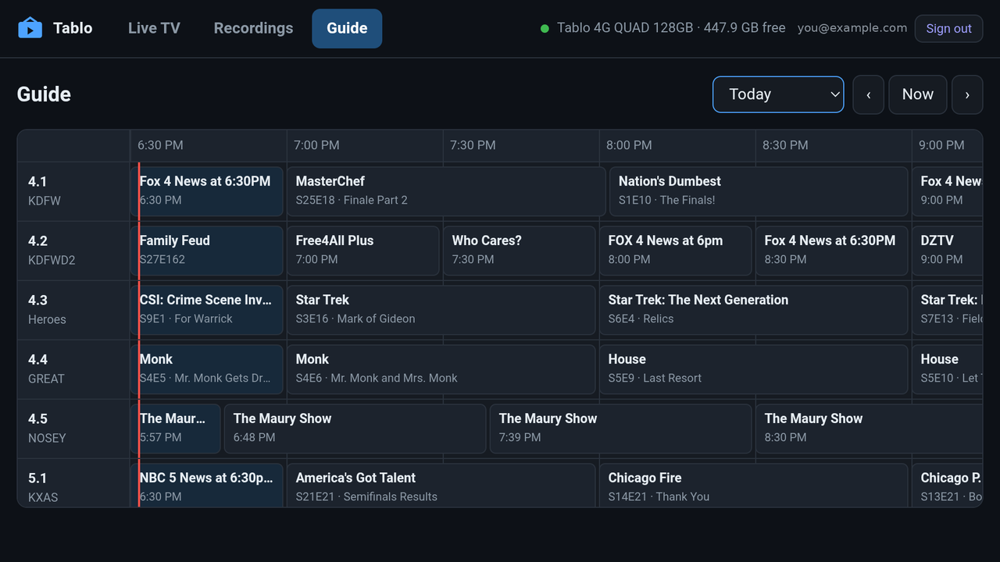
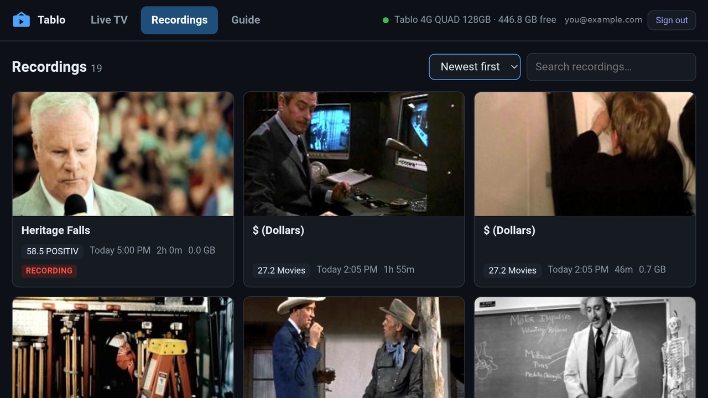

# Tablo for Fire TV

A Fire TV app for the **Tablo 4th-generation** over-the-air DVR: live TV, recordings and the guide,
driven entirely by the remote. It talks to the DVR directly — **no server, no transcoding**.

> **Note:** this only works on the 4th generation (Tablo 4G / QUAD, 2023 onward). Earlier
> generations use a different protocol.

> Unofficial. Not affiliated with, endorsed by, or supported by Tablo, Scripps or Amazon. It talks
> to the DVR the same way the official apps do, using a protocol worked out by watching them.



## What it does

- **Live TV** — every antenna channel, plus the free streaming (FAST) channels on your account,
  with what is on now.
  - **Up / Down change channel.** The channel name shows at once; it tunes when you stop pressing,
    or straight away if you press **Center**.
  - **Pause, rewind and fast-forward live TV.** Everything since you tuned the channel stays
    seekable, and the screen shows how far behind live you are.
- **Multi-view, when there is a tablo-web server on your network** — 2–4 live channels at once.
  See [Multi-view](#multi-view).
- **Recordings** — artwork, search and sort, and seeking.
- **Guide** — a scrolling 14-day grid.
- **Plays the broadcast as-is.** Tablo streams are MPEG-2 video with AC3 audio. Fire TV devices
  decode both in hardware, so the app plays them natively instead of converting them.
- **Keeps itself up to date** from this repository's releases.

| Guide | Recordings |
|---|---|
|  |  |

## Install

The app is not in the Amazon Appstore; it is sideloaded.

**With the Downloader app** (on the Fire TV):

1. Settings → My Fire TV → Developer options: turn on *Install unknown apps* for Downloader
   (install Downloader from the Appstore first).
2. In Downloader, enter the address of the `.apk` from the latest
   **[release](https://github.com/ksaye/tablo-firetv/releases)** and install it.

**With adb** (from a computer on the same network, with ADB debugging turned on in Developer
options):

```bash
adb connect <fire-tv-ip>:5555
adb install io.github.ksaye.tablofiretv-1.0.0.apk
```

Open **Tablo for Fire TV** and sign in with your Tablo account — the same email and password the
Tablo app uses. The Fire TV must be on the same network as the DVR.

When a newer release is published, the app offers to install it when it starts. The first time,
Fire TV asks you to allow the app to install updates.

## The remote

| Button | Browsing | Watching live TV | Watching a recording |
|---|---|---|---|
| **Arrows** | Move around | **↑ ↓** change channel · **← →** skip 10 s | **← →** skip 10 s |
| **Center** | Select | Pause / resume · during a channel change: tune now | Pause / resume |
| **Back** | Close a panel, or leave | Stop watching | Stop watching |

Hold an arrow to repeat; skips get longer the longer you hold.

## Multi-view

A Fire TV can decode only about one HD broadcast channel at a time, so it cannot tile several by
itself. A [tablo-web](https://github.com/ksaye/tablo-web) server can: it combines the channels into
a single stream the Fire TV plays easily.

If a tablo-web server (version 1.2.0 or later) is running on the same network and connected to the
same Tablo, the app finds it by itself and a **Multi-view** tab appears. There is nothing to set
up: the app asks the network for a server every minute (UDP port 8788) and signs in to it with the
Tablo account it already has. With no server, the tab stays hidden.

- Pick 2–4 channels and start. **← / →** move the sound between panes (the server draws a yellow
  border round the one you hear); **Center** shows which pane has the sound; **Back** stops.
- Every antenna channel uses a tuner while multi-view runs.
- tablo-web on Windows opens the firewall for this itself. In Docker it needs host networking —
  see tablo-web's [Docker notes](https://github.com/ksaye/tablo-web/blob/main/docs/docker.md#networking).

## How it works

The interface is the web page from [tablo-web](https://github.com/ksaye/tablo-web), bundled inside
the app and shown in a WebView, with remote navigation added. Where tablo-web runs a server, this
app runs its own small one inside itself, listening only on the device and only answering the app.
It signs in to Tablo's cloud, finds your DVR on the network, and talks to it directly.

Video never plays in the WebView: a native Media3 ExoPlayer plays the DVR's stream, which is why no
transcoding is needed. Recordings are played from a rewritten copy of the DVR's playlist so they
start at the beginning and can be seeked.

## Your account

The app signs in to Tablo's own cloud service, exactly as the official app does. With *Remember me
on this Fire TV* ticked, your email and password are kept in Android's encrypted storage on the
device. **They are sent nowhere except Tablo's login service.** Signing out forgets them.

## A note on the DVR

The Tablo is inexpensive hardware. Loading the full guide is hundreds of requests and the heaviest
thing any app asks of it, so the app keeps the guide on the device and reloads it at most once a
day. Running several Tablo apps against one DVR at once can make it slow to answer.

Every live channel or recording being watched uses one of the DVR's tuners until you stop.

## Building from source

Needs the [.NET 10 SDK](https://dotnet.microsoft.com/download) with the Android workload
(`dotnet workload install maui-android`), a JDK 17 and the Android SDK. See the top of
[`src/TabloFireTv/build-apk.sh`](src/TabloFireTv/build-apk.sh) for creating a signing key.

```bash
TABLOFIRETV_KEYSTORE=/path/to/tablofiretv.keystore TABLOFIRETV_KEYSTORE_PASS=... \
  src/TabloFireTv/build-apk.sh 1.0.0 1
```

Many Fire TV Sticks are 32-bit only; the build includes 32- and 64-bit ARM.

## Related

- **[tablo-web](https://github.com/ksaye/tablo-web)** — the same DVR in any browser.
- **[tablo-windows](https://github.com/ksaye/tablo-windows)** — a Windows app that talks to the DVR
  directly.

## License

MIT — see [LICENSE](LICENSE).
